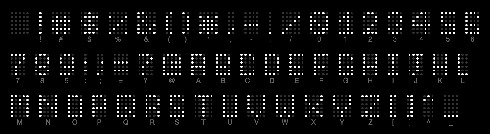
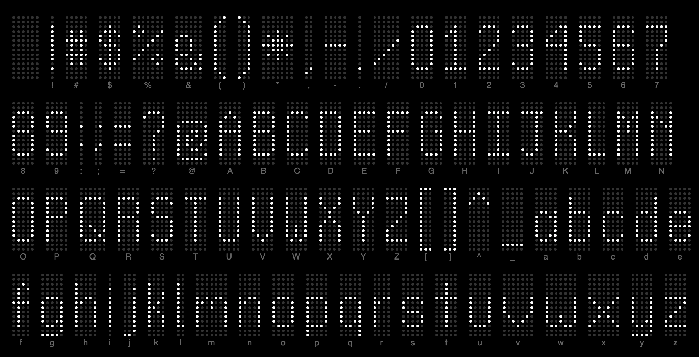

# Bigdots Fonts

The following fonts are available to use when displaying text on your bigdots.io LED board.

## System 6

The smallest possible font, 6 dots high.

* Identifer:            `system-6`
* Monospace:            Yes
* Uppercase supported:  Yes
* Lowercase supported:  No
* Numbers supported:    Yes
* Punction supported:   Yes

## System 16

Designed for at least 16 dots high, though top and bottom padding is builtin.

* Identifer:            `system-16`
* Monospace:            No
* Uppercase supported:  Yes
* Lowercase supported:  Yes
* Numbers supported:    Yes
* Punction supported:   Yes
